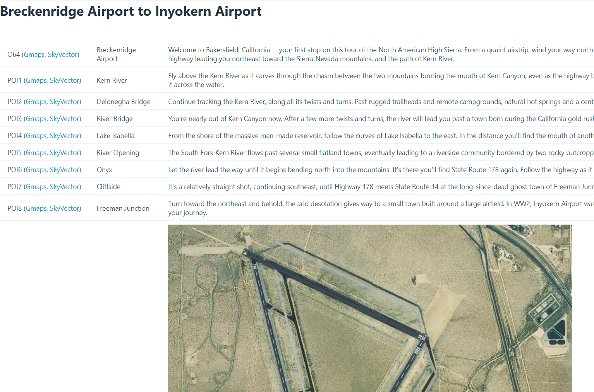

# Flight Simulator 2020 Bush Trip Exporter



I love bush trips but I don't like flying them within the bush trip setting. I want to have ATC, GPS and be able to choose my plane without editing pln files. But I still want to get descriptions of waypoints and be able to follow the plan from the world map.

This convert.py script converts bush trip xml file + flight plan to:
1) html file with leg descriptions
2) append comments / poi names to existing little nav map flight plan

Steps:
1) choose a bush trip
2) decode the bsp using https://github.com/leppie/spb2xml. Example:

```bash
spb2xml-msfs.exe -s "C:\Program Files (x86)\Steam\steamapps\common\MicrosoftFlightSimulator\Packages\fs-base-propdefs\Propdefs\1.0\Common" "C:\Users\mb-dev\AppData\Roaming\Microsoft Flight Simulator\Packages\Official\Steam\asobo-bushtrip-nevada\Missions\Asobo\BushTrips\nevada\Nevada.spb"
```

3) Open the flt in Little Nav Map and save it as a lnmpln file
4) Update paths in convert.py script and execute

NOTE: right now there's one issue with exported lnmpln file - LittleNavMap wants the:
```
<?xml version="1.0" ?>
```
to be in its own line but minidom doesn't do it. So edit the output lnmpln and add line break after the first xml descriptor tag.