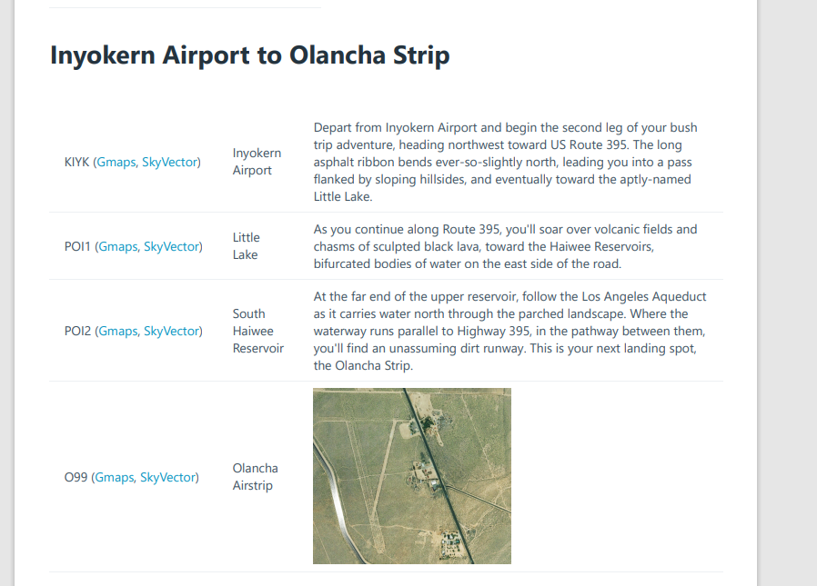

# Flight Simulator 2020 Bush Trip Exporter

I love bush trips but I don't like flying them within the bush trip setting. I want to have ATC, GPS and be able to choose my plane without editing pln files. But I still want to get descriptions of waypoints and be able to follow the plan from the world map.

This convert.py script generates for all msfs default bush trips:
1) html file with leg descriptions and images
2) pdf file with links to google maps and sky vector
3) pln file for each leg of the trip

Download the ones I uploaded:
* [Alaska](https://flightsim.to/file/28443/alaska-bush-trip-navlog-pdf-flight-plan)
* Australia:
    * [Tasmanian Odyssey](https://flightsim.to/file/28566/tasmanian-odyssey-bush-trip-navlog-pdf-flight-plan)
    * [From the Sea Into the Desert](https://flightsim.to/file/28706/from-the-sea-into-the-desert-australia-bush-trip-navlog-pdf-flight-plan)
    * [Southeastern](https://flightsim.to/file/28685/australia-southeastern-bush-trip-navlog-pdf-flight-plan)
    * [Northwestern Kimberly Coast](https://flightsim.to/file/28684/northwestern-kimberly-coast-australia-bush-trip-navlog-pdf-flight-plan)
* [Balkans](https://flightsim.to/file/28571/balkans-bush-trip-navlog-pdf-flight-plan)
* [Chile](https://flightsim.to/file/28570/chile-bush-trip-navlog-pdf-flight-plan)
* [Denmark](https://flightsim.to/file/28569/denmark-bush-trip-navlog-pdf-flight-plan)
* [Finland](https://flightsim.to/file/28572/finland-trip-navlog-pdf-flight-plan)
* [France](https://flightsim.to/file/28437/france-bush-trip-navlog-pdf-flight-plan)
* [Germany](https://flightsim.to/file/28715/germany-bush-trip-navlog-pdf-flight-plan)
* [Grand Alpine](https://flightsim.to/file/28442/grand-alpine-bush-trip-navlog-pdf-flight-plan)
* [Nevada](https://flightsim.to/file/28350/nevada-bush-trip-text)
* [Swiss](https://flightsim.to/file/28683/swiss-bush-trip-navlog-pdf-flight-plan)

Steps:
1) download https://github.com/leppie/spb2xml and update the path at the top of the file:
2) Update the rest of the paths in convert.py script and execute

Next step: support custom bush trips